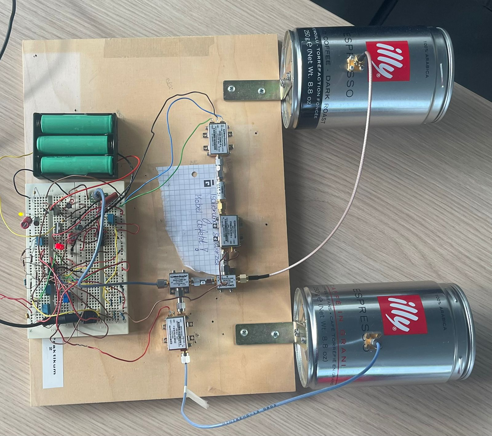
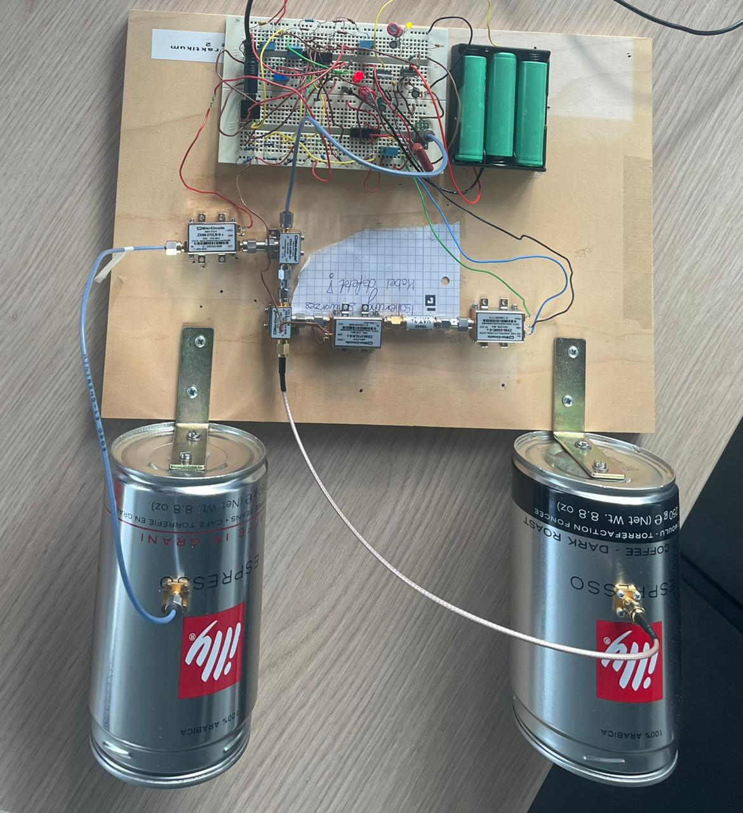
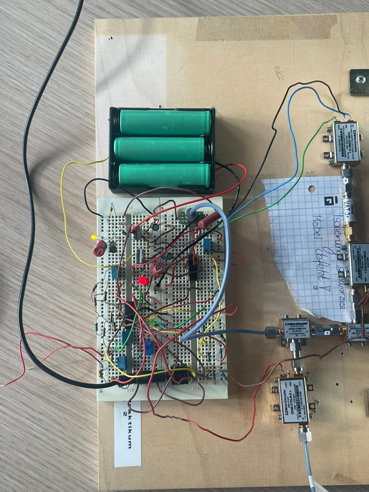
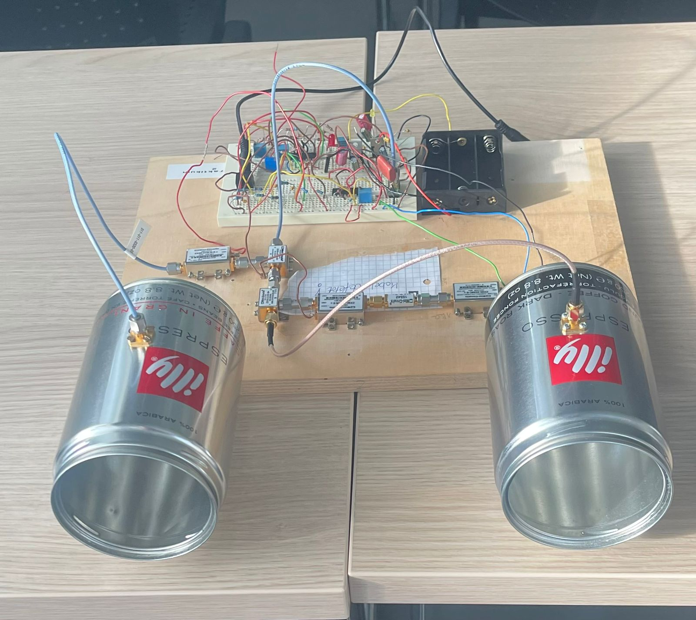
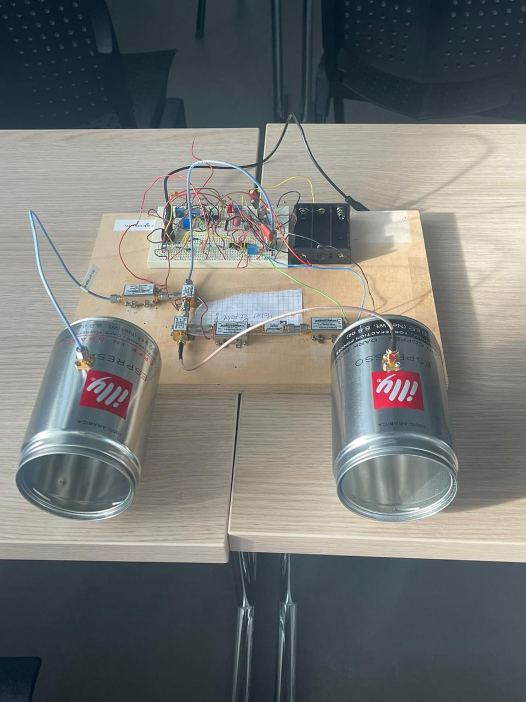
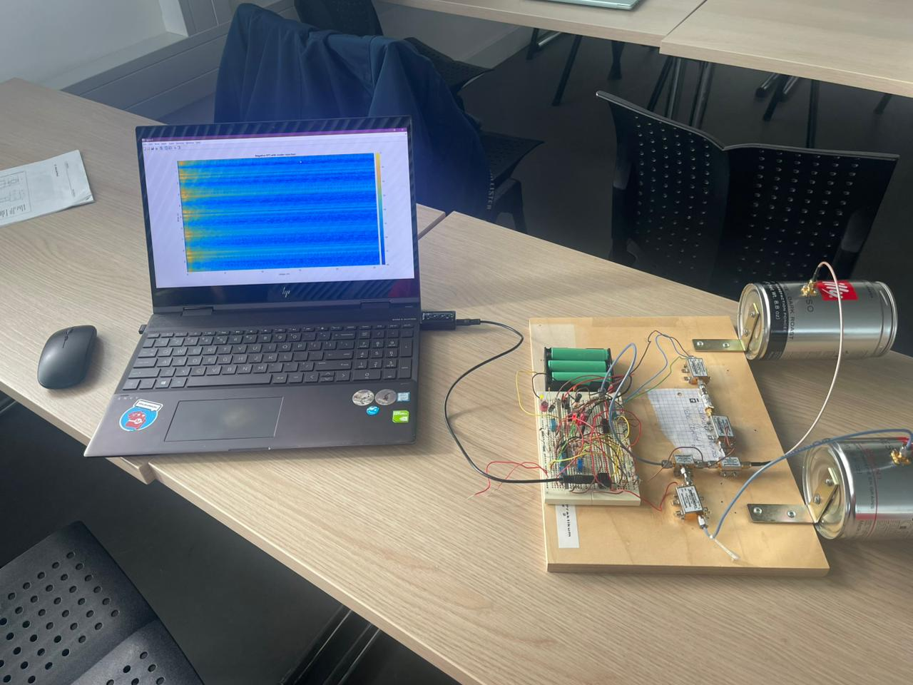
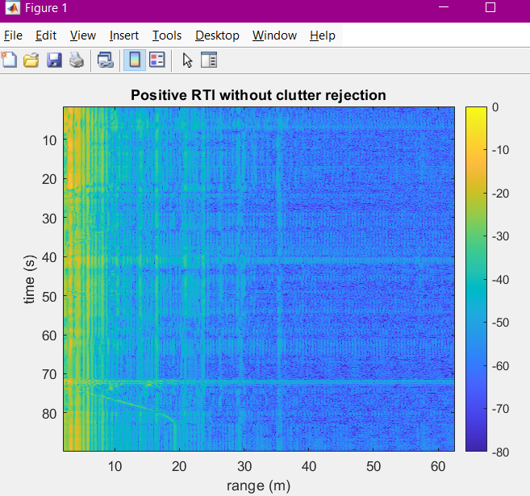
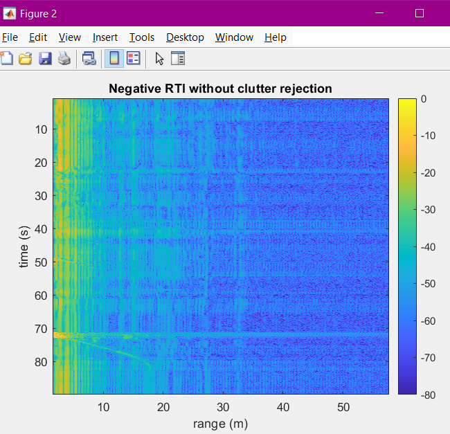
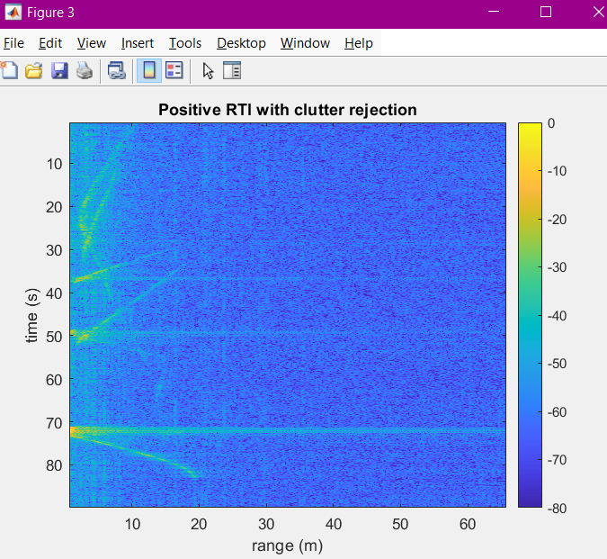
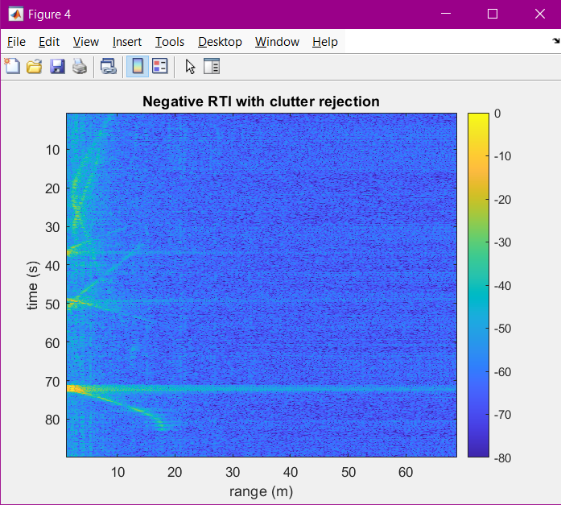

# FMCW Radar Prototype (Hardware + Software)

  

## Overview
This project is a practical implementation of a **Frequency Modulated Continuous Wave (FMCW) radar**.
I assembled the **IF/baseband circuit** on a breadboard, connected it to an **RF front-end**, and processed the recorded beat signal in **MATLAB** to generate **Range–Time Intensity (RTI) heatmaps**.

---

## System Architecture

  

Main parts:
1. **RF TX/RX front-end:** VCO/modulator, PA, divider, LNA, mixer, antennas  
2. **IF/Baseband chain (breadboard):** power supply, ramp generator + sync, low-pass filter, video amplifier  
3. **Software processing:** sync-triggered slicing + FFT → RTI heatmap

---

## IF / Baseband Hardware (Breadboard)

### Power Supply

  

### Ramp (Triangle) Generator

  

### Low-pass Filter

  

### Video Amplifier

  

---

## Build Photos

  
  
  

  
  
  

---

## Software Processing (MATLAB)

The radar output was recorded as a **stereo audio signal**:
- **Channel 1:** sync/trigger (square wave)
- **Channel 2:** IF/beat signal (scaled)

The script performs:
1. **Read from file or record live**
   - `READ_FROM_FILE = true` reads a `.wav`
   - otherwise records from the selected audio device
2. **Sync detection**
   - Convert trigger to 0/1 using a threshold
   - Detect **rising** and **falling** edges
3. **Fast-time / slow-time slicing**
   - Use each edge as the start of one ramp
   - Build matrices: `pos_signal_mat` and `neg_signal_mat`
     - rows = slow time (chirps)
     - columns = fast time (samples per chirp)
4. **DC-bias removal**
   - Remove mean across fast time and slow time to reduce constant offsets
5. **FFT across fast time**
   - Zero-padding improves frequency (range) resolution
   - Convert magnitude to dB and normalize
6. **Clutter rejection (MTI-like)**
   - `diff()` across slow time reduces stationary reflections

### How to run
- Put the `.wav` file next to the MATLAB script (or update the filename in `audioread()`).
- Run the script to generate RTI plots.

> Note: If your `.wav` is large, it’s better not to commit it to GitHub (or use Git LFS).

---

## Results: RTI Heatmaps (Street Recording)

These RTI heatmaps were generated from a **street recording**. Over time, the scene included:
**a pedestrian → a cyclist → a car → a bus**.

- Without clutter rejection: stationary reflections/strong background are more visible.
- With clutter rejection: moving objects stand out more clearly.

  
  

  
  

---

## Notes
- Keep wiring short and ensure solid grounding to reduce noise/coupling.
- Verify each stage independently before connecting the full system.
- If the IF signal clips, reduce video amplifier gain.

## Keywords
FMCW Radar, RTI, Beat Frequency, FFT, Clutter Rejection, MTI, Range-Time Heatmap
