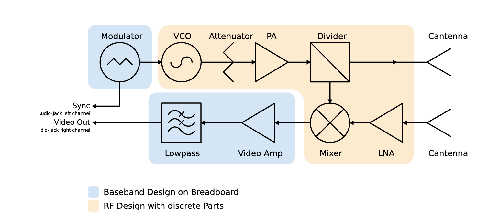

# FMCW Radar Prototype (Hardware Build)

(Images/4.jpg)
## Overview
This project is a hands-on build of a **Frequency Modulated Continuous Wave (FMCW) radar**.  
I assembled the **baseband (IF) circuitry on a breadboard** and connected it to an **RF front-end** to transmit/receive signals, then extracted the **beat signal** for target detection using FFT-based analysis.

## How it works (short)
An FMCW radar transmits a frequency-modulated (triangular ramp) RF signal. The received echo is delayed in time, and when it’s mixed with a copy of the transmitted signal, it produces a **beat frequency**.  
That beat frequency contains information about **range** (and with up/down ramps, can also indicate **relative motion**).

*(Optional figure)*  

## System Block Diagram

**Main parts:**
- **Baseband / IF (breadboard):** power supply, ramp (triangle) generator + sync, low-pass filter, video amplifier
- **RF front-end:** VCO/modulator, PA, divider, LNA, mixer, antennas
- **Signal capture & processing:** the filtered/amplified beat signal is measured and analyzed (FFT)

## Hardware Build Summary
### Baseband / IF chain
- Built the **power supply** and verified rails before connecting everything else
- Built the **triangle ramp generator** (with a sync output for debugging/measurement)
- Added the **low-pass filter** (to keep the beat signal within the usable bandwidth)
- Added the **video amplifier** stage (adjustable gain)

### RF chain
- Connected RF modules following the system block diagram
- Used SMA cables between RF components
- Mounted RF parts on a wooden base to keep connections stable
- Connected the mixer output into the IF chain

## How to use
1. Power the circuit and confirm stable supply voltages.
2. Verify the ramp generator output (triangle + sync).
3. Confirm the IF output amplitude stays in a reasonable range (no clipping).
4. Capture the **video/beat** signal and run FFT to identify peaks (targets).

## Gallery
Top view of the assembled prototype:

## Notes
- Keep wires short and double-check grounding to reduce coupling/noise.
- Verify each stage independently before connecting the full chain.
- If FFT peaks are noisy, re-check gain, filtering, and cable connections.

## Acknowledgment
Built following a Radar Lab FMCW radar workflow (block diagram + IF/RF assembly approach).

